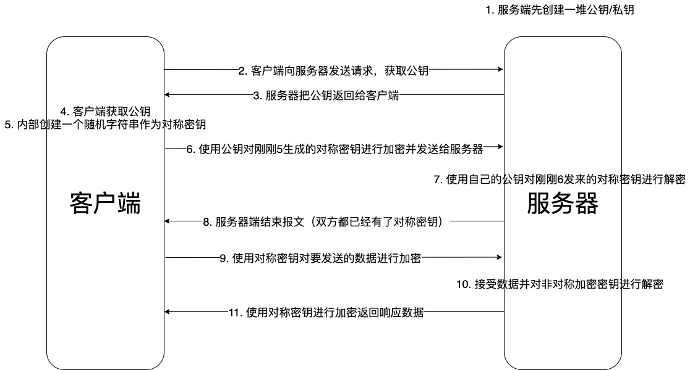
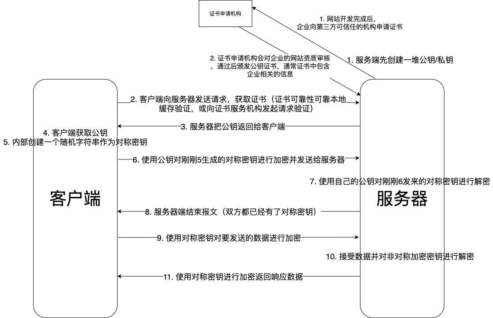

# js逆向

## MD5加密

**输出是16位或32位**，在遇到这种位数的加密数据，优先考虑使用的是MD5加密方式。MD5理论上是不可破解的，因为hash函数一般不存在碰撞。如果需要当前最优秀的计算机100年的时间破解，则可以说MD5加密是安全的。

增加破解成本的方法很多，例如，通过无意义的随机私钥进行MD5进行加密；将MD5加密后的无意义随机串和加密信息继续进行MD5加密；最后，在对生成的MD5进行MD5加密。在网站中登陆、注册的账号一般都是通过MD5加密的。

## AES/DES加密

AES/DES都是对称加密技术，即需要通过相同的密钥进行加密和解密的过程。DES加密后密文长度是8的整数倍，AES的结果是16的整数倍。

通过CryptoJS包可以通过Crypto.AES和Crypto.DES调用，对数据进行加密和解密。DES入口三个参数，Key，即密钥；Data是要被加密的数据；Mode是DES的工作方式；Padding是长度的填充，即如果加密后密文长度无法达到指定8或16的倍数用这个字符填充，默认为CryptoJS.pad.Pkcs7。

## RSA加密

RSA是一种非对称加密算法，加密和解密过程中使用的是不同的密钥。公钥和私钥是不可分割的一对，将数据加密使用公钥，解密使用私钥。私钥是由公钥生成的。

在JS源码中看到setPublicKey，SetPrivateKey等字眼，要有意识到网站使用的加密方式很有可能是RSA非对称加密。

## Base64编码

看起来Base64是一种加密方式，但是其实是用`[A-z0-9+/=]`字符对任意的二进制数据进行加密的过程。

## https加密

使用第三方抓包工具时，访问https网站需要配置https证书，它底层是靠证书加密方式进行的。http协议是依靠明文进行传输的，如果有第三方黑客的存在，则可能会被拦截。解决这个问题必然需要依靠密文传输的方式进行信息交流。

通过构建一个对称密钥，在服务端和客户端都通过这个密钥进行加密解密从而进行沟通。但是这里有一个bug，密钥是由谁生成的？又如何保证客户端和服务端都有这个密钥？如果被黑客拿走了怎么办？

因此，https同时结合了对称加密和非对称加密技术，通过非对称加密对对称加密的密钥进行加密从而保证安全性。如下图所示：

这里有一个问题，黑客可以通过伪装为一个服务器，给客户端浏览器发送一个自己的公钥，并通过自己的公钥将客户端返回的随机对称密钥进行解密从而获取破解https密文内容的密钥。这时候，就有了https-ca加密机制了，如下图所示：

